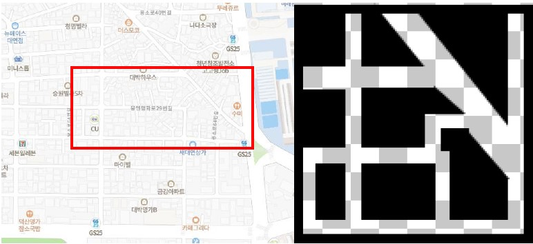
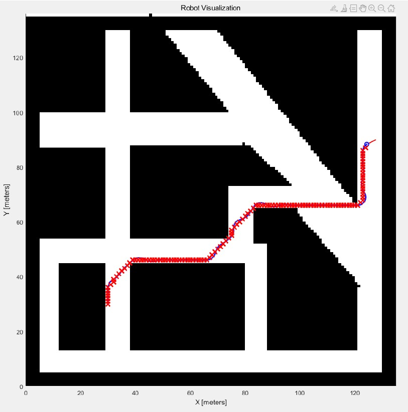

# Mobile Robot Navigation via Mobile Robotics Simulation Toolbox (A* Algorithm)
［2021년 2학기 디지털제어및실험 Term Project］
## 1. Topic
자신만의 맵을 만들고, 해당 맵상에서 로봇의 시작위치와 최종위치를 정의하여 내비게이션하기.
## 2. Concept
###  1) Map

학교 공학관 근처 자취촌을 기반으로 맵 제작

자취방 근처 CU에서 수미식당까지의 최단 경로 탐색

### 2) 구현
#### (1) Path planning
- A*(A Star) Algorithm 사용
- Matlab Addon - A*(A Star) Search for path planning tutorial (ver 1.2.0.1) 수정
    - 마우스로 격자 칸을 클릭하여 Start point, Obstacle point, Goal point 를 설정하고 A* 알고리즘을 통해 경로를 찾아주는 Addon
    - 마우스 클릭 대신 Map을 가져와 Obstacle : -1, Space(이동 가능한 공간) : 2, Start point : 1, Goal point : 0 으로 설정
    - 현재 위치에서 8방향으로 탐색
    - 휴리스틱 함수 h(n)은 이동가능한 좌표와 Goal point 사이의 Euclidean distance 사용

> Paul Premakumar (2022). A* (A Star) search for path planning tutorial (https://www.mathworks.com/matlabcentral/fileexchange/26248-a-a-star-search-for-path-planning-tutorial), MATLAB 

#### (2) Sensor
- Mobile Robotics Simulation Toolbox 내장 Lidar
  
#### (3) Controller
- The Pure Pursuit Algorithm

### 3) 결과
#### (1) Waypoint


#### (2) Simulation


## 3. 사용법

### 0-1) [mobile-robotics-simulation-toolbox](https://github.com/mathworks-robotics/mobile-robotics-simulation-toolbox) zip download 또는 git clone 하기
> MathWorks Student Competitions Team (2022). Mobile Robotics Simulation Toolbox (https://github.com/mathworks-robotics/mobile-robotics-simulation-toolbox), GitHub.
### 0-2) 관련 애드온 설치(GettingStarted.mlx > System Requirements 참고)
### 0-3) mobile-robotics-simulation-toolbox 폴더에 프로젝트 파일 옮기기
### 0-4) startMobileRoboticsSimulationToolbox.m 열어서 실행 -> Gettingstarted.mlx 파일 열림

### 1) 흑백으로 이루어진 이미지(.png) 파일 준비(Black : Obstacle, White : Space)
### 2) MakeMap 폴더의 map_making.m 파일을 열어서 이미지 파일명 입력 후 실행
```mcode
clc,close,clear;

image = imread('map1.png'); % 이미지 파일명 기입

bwimage = image > 0.5;

map = binaryOccupancyMap(bwimage);
show(map)
```
### 3) 작업 공간에 binaryOccupancyMap 생성 > 마우스 우클릭 > 다른 이름으로 저장 > map.mat로 저장
### 3) Termproject_main.m 파일 열어서 Start point = InitPose 배열 수정(19) / Goal point = xTarget, yTarget 수정(45-47) 후 실행 
```mcode
%% EXAMPLE: Differential Drive Path Following
% In this example, a differential drive robot navigates a set of waypoints 
% using the Pure Pursuit algorithm while avoiding obstacles using the
% Vector Field Histogram (VFH) algorithm.
% 
% Copyright 2019 The MathWorks, Inc.

%% Simulation setup
% Define Vehicle
R = 0.1;                        % Wheel radius [m]
L = 0.1;                        % Wheelbase [m]
dd = DifferentialDrive(R,L);

% Sample time and time array
sampleTime = 0.1;              % Sample time [s]
tVec = 0:sampleTime:27.7;      % Time array

% Initial conditions
initPose = [30;30;pi/2];       % Initial pose (x y theta), ** Start point 설정
pose = zeros(3,numel(tVec));   % Pose matrix
pose(:,1) = initPose;

% Load map
close all
load map

% Create map matrix
Map=occupancyMatrix(map);
MAP = flipud(double(Map))';

% Create lidar sensor
lidar = LidarSensor;
lidar.sensorOffset = [0,0];
lidar.scanAngles = linspace(-pi/2,pi/2,30);
lidar.maxRange = 5;

% Create visualizer
viz = Visualizer2D;
viz.hasWaypoints = true;
viz.mapName = 'map';
attachLidarSensor(viz,lidar);

%% Path planning and following

% Set the target points, ** Goal point 설정
xTarget = 124;
yTarget = 87;

% Create waypoints
waypoints = Astar(initPose(1),initPose(2),xTarget,yTarget,MAP,map.XWorldLimits(2),map.YWorldLimits(2));

% Pure Pursuit Controller
controller = controllerPurePursuit;
controller.Waypoints = waypoints;
controller.LookaheadDistance = 0.9;
controller.DesiredLinearVelocity = 5;
controller.MaxAngularVelocity = 15;

% Vector Field Histogram (VFH) for obstacle avoidance
vfh = controllerVFH;
vfh.DistanceLimits = [10 10];
vfh.NumAngularSectors = 10;
vfh.HistogramThresholds = [10 10];
vfh.RobotRadius = L;
vfh.SafetyDistance = L;
vfh.MinTurningRadius = 0.01;

%% Simulation loop
r = rateControl(1/sampleTime);
for idx = 2:numel(tVec) 
    
    % Get the sensor readings
    curPose = pose(:,idx-1);
    ranges = lidar(curPose);
        
    % Run the path following and obstacle avoidance algorithms
    [vRef,wRef,lookAheadPt] = controller(curPose);
    targetDir = atan2(lookAheadPt(2)-curPose(2),lookAheadPt(1)-curPose(1)) - curPose(3);
    steerDir = vfh(ranges,lidar.scanAngles,targetDir);    
    if ~isnan(steerDir) && abs(steerDir-targetDir) > 0.1
        wRef = 0.5*steerDir;
    end
    
    % Control the robot
    velB = [vRef;0;wRef];                   % Body velocities [vx;vy;w]
    vel = bodyToWorld(velB,curPose);  % Convert from body to world
    
    % Perform forward discrete integration step
    pose(:,idx) = curPose + vel*sampleTime; 
    
    % Update visualization
    viz(pose(:,idx),waypoints,ranges)
    waitfor(r);
end
```
